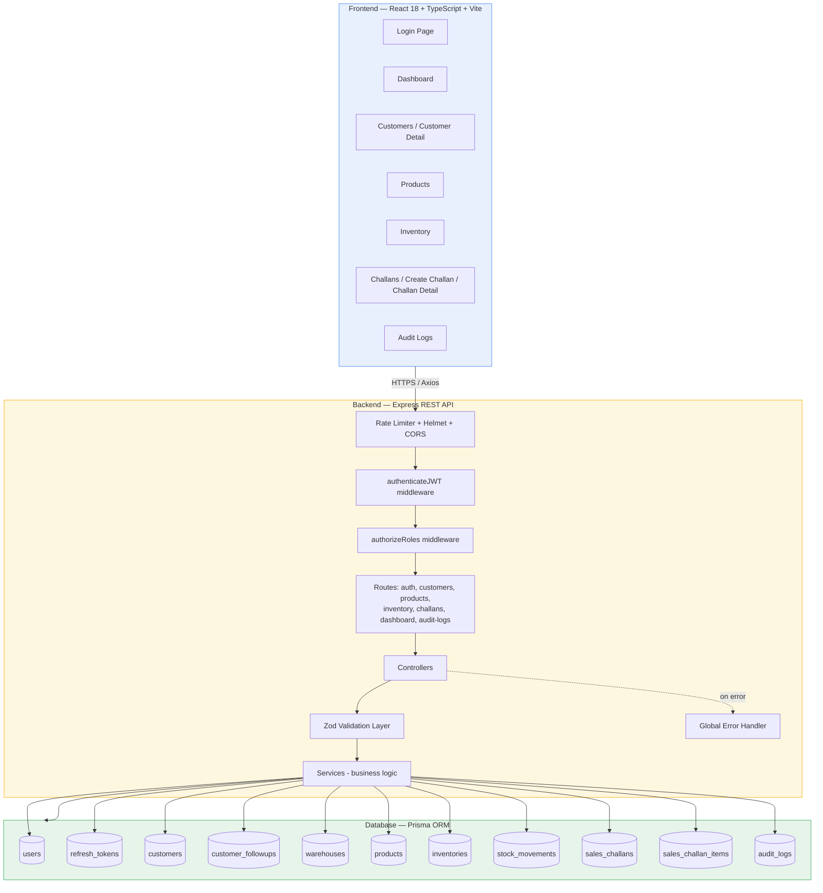

# NexusERP Operations Suite
### Mini ERP + CRM Operations Portal — Full Stack Developer Case Study

A production-grade web application for wholesale/distribution businesses to manage customer relationships (CRM), warehouse stock, sales challans with automatic inventory deduction, and role-based operations across Admin, Sales, Warehouse, and Accounts teams.


## Business Context

NexusERP supports the daily operations of a wholesale/distribution company: managing customers, products, stock across multiple warehouses, sales challans, and CRM follow-ups. It is used internally by Sales, Warehouse, and Accounts teams, each with access scoped to their role via JWT-based RBAC.

---

## Tech Stack

### Backend
- Node.js + Express.js, written in TypeScript (run via `tsx`)
- **Prisma ORM** — SQLite for local development, PostgreSQL for production
- JWT authentication (`jsonwebtoken`) with **short-lived access tokens (15 min)** + **DB-backed, revocable refresh tokens (7 days)**
- Password hashing via `bcryptjs`
- Request validation via **Zod** schemas
- Security/hardening: `helmet`, `cors`, `express-rate-limit` (200 req / 15 min per IP), `compression`
- Structured logging via `winston` + `morgan`
- API documentation via **Swagger UI** (`/api-docs`), served from `backend/swagger.json`
- Testing: `jest` + `supertest`

### Frontend
- React 18 + TypeScript, built with **Vite**
- Tailwind CSS + `lucide-react` icons
- **TanStack Query (React Query v5)** for server state, caching, and refetching
- React Router DOM v6 for routing, with role-aware protected routes
- React Hook Form + Zod resolvers for form validation
- Axios for the API client
- Client-side CSV export on Customers, Products, Inventory, Challans, and Audit Log tables

### DevOps
- Dockerfiles for both `backend` and `frontend`, orchestrated via `docker-compose.yml` (Postgres + backend + frontend)
- GitHub Actions CI/CD (`.github/workflows/ci-cd.yml`)
- Deployed via **Render** (backend + managed Postgres, `render.yaml` Blueprint) and **Vercel** (frontend, `vercel.json`)

---

## Architecture

3-tier architecture: a React SPA, a layered Express REST API (routes → controllers → services → Prisma), and a relational database (SQLite locally, PostgreSQL in production).




## Data Model

Modeled with Prisma (`backend/prisma/schema.prisma`, with a parallel `schema.postgres.prisma` for production):

| Model | Purpose |
|---|---|
| `User` | Login identity + role (`ADMIN`, `SALES`, `WAREHOUSE`, `ACCOUNTS`) |
| `RefreshToken` | DB-backed, revocable refresh tokens tied to a user |
| `Customer` | CRM record — type (Retail/Wholesale/Distributor), status, GST, follow-up date, notes; soft-deletable |
| `CustomerFollowup` | Follow-up notes tied to a customer and the user who logged them |
| `Warehouse` | Named storage location (e.g. Central Distribution Hub, North Regional Depot) |
| `Product` | SKU, category, unit price, minimum stock threshold; soft-deletable |
| `Inventory` | Per-(product, warehouse) quantity — unique constraint on the pair |
| `StockMovement` | Immutable IN/OUT log with reason, actor, and optional linked challan |
| `SalesChallan` | Challan header — status (`DRAFT`/`CONFIRMED`/`CANCELLED`), **JSON customer snapshot**, totals |
| `SalesChallanItem` | Line item — quantity, unit price, **JSON product snapshot** (decoupled from live product data) |
| `AuditLog` | Action, entity, entity ID, actor, IP address, timestamp for every sensitive operation |

The **snapshot fields** (`customerSnapshot`, `productSnapshot`) are stored as JSON strings, satisfying the requirement that challans preserve point-in-time data rather than only referencing live product/customer IDs.

---

## Core Modules

### 1. Authentication & Roles
- `POST /api/auth/login` issues an access token + refresh token, and creates an audit log entry.
- Roles: `ADMIN`, `SALES`, `WAREHOUSE`, `ACCOUNTS`, enforced by `authorizeRoles()` middleware per route.
- Only `ADMIN` can create new users via `POST /api/auth/users`.

### 2. Customer CRM Module
Fields: `customerName`, `businessName`, `email` (unique), `mobile`, `gstNumber` (optional, unique), `customerType` (Retail/Wholesale/Distributor), `address`, `status`, `followupDate`, `notes`.
Features: add, edit, soft-delete (Admin only), search/list, detail view, add follow-up notes.

### 3. Product & Inventory Module
Products carry `name`, `sku` (unique), `category`, `tag`, `unitPrice`, `minStock`, `imageUrl`.
Inventory is tracked **per warehouse** via the `Inventory` join model. Every stock change is recorded in `StockMovement` with type `IN`/`OUT`, a reason, and the acting user.
`POST /api/inventory/adjust` lets Admin/Warehouse manually adjust stock outside the challan flow.

### 4. Sales Challan Module
Flow: select customer → add line items with quantity/price → system generates a sequential challan number (`CH-<year>-<seq>`, e.g. `CH-2026-000001`) → save as Draft.
Confirming reduces stock (with pre-validation across all items so partial failures can't leave inconsistent state); cancelling a confirmed challan restores it. Both paths are fully audited.

---

## API Reference

Base URL (local): `http://localhost:5000/api` · Interactive docs: `/api-docs` (Swagger UI)

| Method | Endpoint | Description | Roles |
|---|---|---|---|
| POST | `/auth/login` | Login, returns access + refresh token | Public |
| POST | `/auth/register` | Register user | Public* |
| POST | `/auth/refresh` | Exchange refresh token for new access token | Authenticated |
| POST | `/auth/logout` | Revoke refresh token | Authenticated |
| GET | `/auth/me` | Current user profile | Authenticated |
| POST | `/auth/users` | Admin-created user | Admin |
| GET | `/customers` | List customers (paginated, searchable) | All roles |
| GET | `/customers/:id` | Customer detail | All roles |
| POST | `/customers` | Create customer | Admin, Sales |
| PUT | `/customers/:id` | Edit customer | Admin, Sales |
| DELETE | `/customers/:id` | Soft-delete customer | Admin |
| POST | `/customers/:id/followups` | Add follow-up note | Admin, Sales |
| GET | `/products` | List products (paginated, searchable) | All roles |
| GET | `/products/categories` | Distinct category list | All roles |
| GET | `/products/:id` | Product detail | All roles |
| POST | `/products` | Create product | Admin, Warehouse |
| PUT | `/products/:id` | Edit product | Admin, Warehouse |
| DELETE | `/products/:id` | Soft-delete product | Admin |
| POST | `/inventory/adjust` | Manual stock adjustment | Admin, Warehouse |
| GET | `/inventory/movements` | Stock movement log | All roles |
| GET | `/inventory/warehouses` | List warehouses | All roles |
| GET | `/challans` | List challans (paginated, filter by status/customer) | All roles |
| GET | `/challans/:id` | Challan detail | All roles |
| POST | `/challans` | Create challan (Draft) | Admin, Sales, Accounts |
| PATCH | `/challans/:id/status` | Confirm / Cancel a challan | Admin, Sales, Warehouse, Accounts |
| GET | `/dashboard/summary` | Aggregate KPIs for dashboard | Authenticated |
| GET | `/audit-logs` | System audit trail | Admin, Accounts |

_*`/auth/register` is public in code; consider gating this behind an invite flow before real production use._

All endpoints:
- Validate input via Zod, returning field-level error messages on `400`
- Use standard HTTP status codes (`200`, `201`, `400`, `401`, `403`, `404`, `500`)
- Support pagination (`page`, `limit`) and search/status filters where applicable
- Are documented in `backend/swagger.json` and `backend/postman_collection.json`

---

## Project Structure

```
erp-portal/
├── backend/
│   ├── src/
│   │   ├── config/            # env & app config
│   │   ├── controllers/       # auth, customer, product, inventory, challan, dashboard, audit
│   │   ├── services/          # business logic per module
│   │   ├── routes/            # Express routers, mounted under /api
│   │   ├── middlewares/       # auth.middleware, role.middleware, error.middleware
│   │   ├── validations/       # Zod schemas per module
│   │   ├── utils/             # prisma client, jwt helpers, logger, apiResponse
│   │   ├── types/
│   │   └── index.ts           # app bootstrap, security middleware, Swagger, health check
│   ├── prisma/
│   │   ├── schema.prisma          # SQLite (local dev)
│   │   ├── schema.postgres.prisma # PostgreSQL (production)
│   │   └── seed.ts                # seeds users, warehouses, customers, products, sample challan
│   ├── tests/api.test.ts
│   ├── swagger.json
│   ├── postman_collection.json
│   ├── Dockerfile / Dockerfile.dev
│   └── package.json
├── frontend/
│   ├── src/
│   │   ├── pages/              # Login, Dashboard, Customers, CustomerDetail, Products,
│   │   │                       # Inventory, Challans, CreateChallan, ChallanDetail, AuditLogs, Profile
│   │   ├── components/
│   │   │   ├── layout/
│   │   │   └── ui/
│   │   ├── context/             # AuthContext
│   │   ├── lib/, utils/, types/
│   │   └── App.tsx              # routing + role-protected routes
│   ├── Dockerfile / Dockerfile.dev
│   ├── vercel.json
│   └── package.json
├── .github/workflows/ci-cd.yml
├── docker-compose.yml
├── render.yaml
└── README.md
```

---

## Local Setup

### Prerequisites
- Node.js v18+
- npm

### Backend (uses local SQLite — zero config)
```bash
cd backend
npm install
npx prisma generate
npx prisma db push      # creates local SQLite schema
npm run prisma:seed     # seeds users, warehouses, customers, products, sample challan
npm run dev             # starts on http://localhost:5000
```

### Frontend
```bash
cd frontend
npm install
npm run dev              # starts on Vite's default port (e.g. http://localhost:5173)
```

Set `frontend/.env` (copy from `.env.example`) so `VITE_API_BASE_URL` points at your backend, e.g. `http://localhost:5000/api` for local dev.


## Deployment

| Layer | Platform | Notes |
|---|---|---|
| Frontend | **Vercel** | Import the `frontend` directory, framework preset = Vite, set `VITE_API_BASE_URL` to the live backend URL. Config in `frontend/vercel.json`. |
| Backend | **Render** | `render.yaml` Blueprint provisions the Node web service and a managed free-tier Postgres instance automatically. Build: `npm run render:build` (Prisma generate against Postgres schema + `tsc`). Start: `npm run render:start` (`prisma db push` + seed + `node dist/index.js`). |
| Database | **Render Postgres** | Free-tier managed Postgres, connection string injected via `DATABASE_URL`. |
| CI/CD | **GitHub Actions** | `.github/workflows/ci-cd.yml` — see repo for the pipeline definition. |

Live deployment:
- Frontend: https://erp-portal-git-master-prachanda.vercel.app
- Backend health check: https://erp-portal-pqpl.onrender.com/health
- Swagger docs: https://erp-portal-pqpl.onrender.com/api-docs

---

## Test Credentials

| Role | Email | Password |
|---|---|---|
| Admin | `admin@minierp.com` | `Admin123!` |
| Sales | `sales@minierp.com` | `Sales123!` |
| Warehouse | `warehouse@minierp.com` | `Warehouse123!` |
| Accounts | `accounts@minierp.com` | `Accounts123!` |

These are created by `backend/prisma/seed.ts` and are safe to use in demo/eval environments only — rotate before any real deployment.

---

## Assumptions

- Stock and challan operations use a **single default warehouse** for deduction/restoration logic even though the schema supports multiple warehouses (`Warehouse` + `Inventory` per warehouse) — full multi-warehouse transfer logic was out of scope for the assignment's timeframe.
- `POST /auth/register` is left open in code for demo convenience; in a real production rollout this should require Admin invitation or be removed in favor of `POST /auth/users`.
- Challan snapshots are stored as JSON strings on the row rather than in separate versioned tables, trading normalization for simplicity.
- SQLite is used for local development for zero-config onboarding; PostgreSQL (via a parallel Prisma schema) is used in production.

---

## Known Limitations

- **Multi-warehouse transfers**: inventory is modeled per warehouse, but challan confirm/cancel logic currently operates against a single default warehouse rather than letting a challan draw from a specific warehouse.
- **Invoice PDF export**: not implemented — CSV export is available instead across Customers, Products, Inventory, Challans, and Audit Logs.
- **Product image uploads to S3**: not implemented; products currently store an `imageUrl` string (e.g. pointing to external image URLs) rather than supporting direct upload.

---

## Bonus Features Implemented

- [x] Docker setup (`docker-compose.yml`, per-service Dockerfiles)
- [x] GitHub Actions CI/CD (`.github/workflows/ci-cd.yml`)
- [x] Swagger/OpenAPI documentation served live at `/api-docs`
- [x] Client-side CSV export across all major list views
- [ ] Export invoice as PDF — not implemented
- [ ] Upload product image to AWS S3 — not implemented
